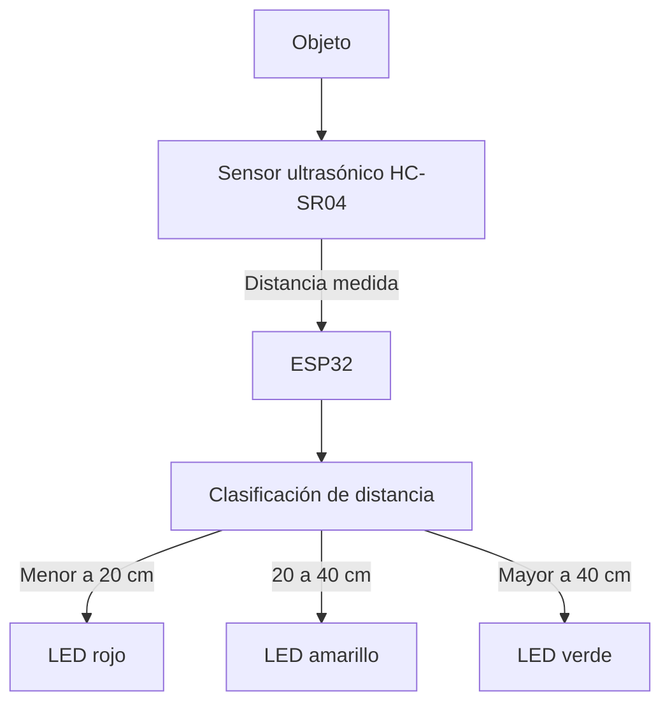
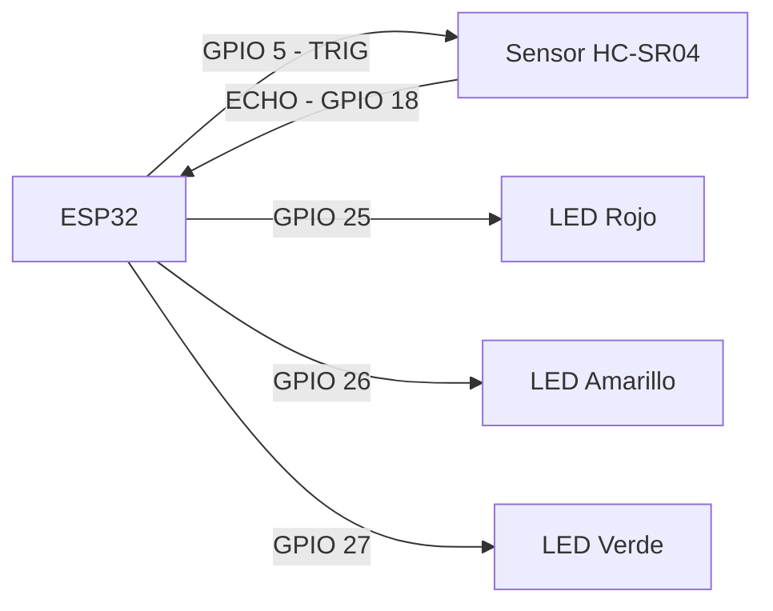
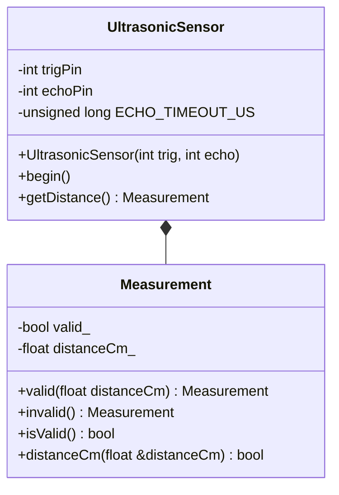
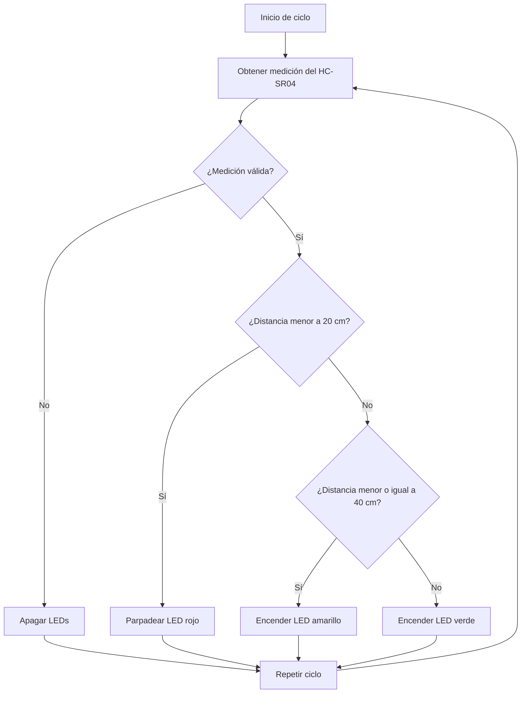

# Práctica 1 — Integración de Sensores y Actuadores en un Objeto Inteligente

## Integrantes

- Nombre integrante 1
- Nombre integrante 2

## Descripción del proyecto

El proyecto consiste en un objeto inteligente basado en un microcontrolador ESP32,
un sensor ultrasónico HC-SR04 y tres LEDs como actuadores.

El sistema mide la distancia entre el sensor ultrasónico y un objeto y, de acuerdo
con la distancia obtenida, activa diferentes LEDs para representar tres estados:
cercano, intermedio y lejano.

---

## 1. Requerimientos Funcionales y No Funcionales

### 1.1 Requerimientos funcionales

- **RF1 — Medición de distancia:** El sistema debe medir la distancia entre el
  sensor ultrasónico y un objeto.

- **RF2 — Clasificación de distancia:** El sistema debe clasificar la distancia
  medida en tres rangos:
  - Distancia menor a 20 cm: estado cercano.
  - Distancia entre 20 cm y 40 cm: estado intermedio.
  - Distancia mayor a 40 cm: estado lejano.

- **RF3 — Control de actuadores:** El sistema debe controlar los LEDs según la
  distancia detectada:
  - Menor a 20 cm: LED rojo parpadeando a 4 Hz.
  - Entre 20 cm y 40 cm: LED amarillo encendido.
  - Mayor a 40 cm: LED verde encendido.

### 1.2 Requerimientos no funcionales

- **RNF1 — Estabilidad:** El sistema deberá funcionar continuamente durante al
  menos 10 minutos sin reinicios ni bloqueos.

- **RNF2 — Exactitud:** La medición del sensor tendrá un error máximo permitido
  de ±3 cm respecto a una medición realizada con una referencia física.

- **RNF3 — Tiempo de respuesta:** El sistema deberá reflejar un cambio de rango
  mediante los LEDs en un tiempo máximo de 1 segundo.

- **RNF4 — Frecuencia de muestreo:** El sistema deberá realizar al menos
  2 mediciones de distancia por segundo.

- **RNF5 — Calidad del código:** El código deberá ser legible, modular,
  orientado a objetos y documentado.

---

## 2. Análisis y Diseño

### 2.1 Arquitectura del sistema

El sistema está compuesto por un sensor ultrasónico HC-SR04, un microcontrolador
ESP32 y tres LEDs utilizados como actuadores.

El sensor HC-SR04 obtiene la distancia existente entre el sensor y un objeto.
Esta información es recibida por el ESP32, que procesa y clasifica la medición
en uno de los tres rangos definidos.

Según el rango detectado, el ESP32 controla los LEDs rojo, amarillo y verde
para representar visualmente el estado de la distancia.

El flujo general del sistema es:

**Objeto → Sensor HC-SR04 → ESP32 → Clasificación de distancia → LEDs**

### 2.2 Diagrama de arquitectura



### 2.3 Conexiones del sistema

Las conexiones utilizadas entre el ESP32, el sensor ultrasónico y los LEDs son:

| Componente | Pin ESP32 |
|---|---:|
| TRIG del HC-SR04 | GPIO 5 |
| ECHO del HC-SR04 | GPIO 18 |
| LED rojo | GPIO 25 |
| LED amarillo | GPIO 26 |
| LED verde | GPIO 27 |

### 2.4 Diagrama de circuito

El siguiente diagrama representa las conexiones lógicas entre el ESP32,
el sensor ultrasónico HC-SR04 y los tres LEDs utilizados como actuadores.



### 2.5 Diagrama estructural

El software utiliza programación orientada a objetos mediante la clase
`UltrasonicSensor`, encargada de gestionar el sensor ultrasónico.

Dentro de esta clase se encuentra la clase `Measurement`, utilizada para
representar una medición y determinar si el valor obtenido es válido.



### 2.6 Diagrama de comportamiento

El funcionamiento del sistema se ejecuta de manera repetitiva. Primero se
obtiene una medición mediante el sensor ultrasónico. Si la medición no es
válida, los LEDs permanecen apagados. Si es válida, la distancia es
clasificada y se activa el actuador correspondiente.



### 2.7 Lógica de control

La lógica utilizada para controlar los actuadores se resume en la siguiente
tabla:

| Rango de distancia | Estado | Comportamiento |
|---|---|---|
| Menor a 20 cm | Cercano (`Near`) | LED rojo parpadea |
| Desde 20 cm hasta 40 cm | Intermedio (`Mid`) | LED amarillo encendido |
| Mayor a 40 cm | Lejano (`Far`) | LED verde encendido |
| Medición inválida | Inválido (`Invalid`) | Todos los LEDs apagados |

---

## 3. Desarrollo e Implementación

### 3.1 Herramientas y tecnologías utilizadas

Para el desarrollo del sistema se utilizaron las siguientes herramientas y
componentes:

- **ESP32 DOIT DevKit V1:** microcontrolador encargado del procesamiento.
- **HC-SR04:** sensor ultrasónico utilizado para medir la distancia.
- **3 LEDs:** rojo, amarillo y verde utilizados como actuadores.
- **PlatformIO:** plataforma utilizada para compilar y cargar el programa.
- **Arduino Framework:** framework utilizado para programar el ESP32.
- **C++:** lenguaje utilizado para implementar el sistema.

### 3.2 Organización del código

El código fuente se encuentra dividido en diferentes archivos con el objetivo
de separar responsabilidades y mantener una estructura modular.

```text
include/
└── UltrasonicSensor.h

src/
├── main.cpp
└── UltrasonicSensor.cpp
```

- **`UltrasonicSensor.h`:** contiene la definición de la clase
  `UltrasonicSensor` y de la clase interna `Measurement`.

- **`UltrasonicSensor.cpp`:** contiene la implementación de los métodos
  encargados de inicializar el sensor y obtener las mediciones de distancia.

- **`main.cpp`:** contiene la lógica principal del sistema: clasificación de
  las distancias, reporte mediante el monitor serial y control de los LEDs.

### 3.3 Implementación orientada a objetos

Para mantener el código modular se implementó la clase `UltrasonicSensor`,
encargada de encapsular el funcionamiento del sensor ultrasónico.

La clase almacena los pines TRIG y ECHO y proporciona los métodos principales:

- `begin()`: configura los pines necesarios para utilizar el sensor.
- `getDistance()`: realiza una medición y devuelve el resultado.
- `Measurement`: representa el resultado de una medición y permite determinar
  si esta es válida antes de utilizar su distancia.

En el programa principal se crea un objeto de esta clase:

```cpp
UltrasonicSensor sensor(TRIG_PIN, ECHO_PIN);
```

De esta manera, la lógica específica del sensor permanece separada de la
lógica principal del sistema.

### 3.4 Obtención de la distancia

Para obtener una medición, el ESP32 genera un pulso de 10 microsegundos a
través del pin TRIG del HC-SR04.

Posteriormente se mide mediante el pin ECHO la duración del pulso recibido.
La distancia se calcula utilizando:

```cpp
float distance = duration * 0.034f / 2.0f;
```

Si no se recibe un pulso dentro del tiempo máximo establecido, la medición se
considera inválida.

### 3.5 Clasificación de la distancia

Después de obtener una medición válida, la función `classifyDistance()` la
clasifica utilizando los umbrales definidos:

```cpp
constexpr float NEAR_THRESHOLD_CM = 20.0f;
constexpr float FAR_THRESHOLD_CM = 40.0f;
```

Para representar los posibles estados se utiliza:

```cpp
enum class DistanceState {
    Invalid,
    Near,
    Mid,
    Far
};
```

Los estados corresponden a:

| Estado | Condición |
|---|---|
| `Near` | Distancia < 20 cm |
| `Mid` | Distancia >= 20 cm y <= 40 cm |
| `Far` | Distancia > 40 cm |
| `Invalid` | Medición no válida |

### 3.6 Control de los LEDs

La función `applyLedState()` recibe el estado correspondiente a la distancia
medida y controla los tres LEDs.

- En estado `Near`, únicamente el LED rojo parpadea.
- En estado `Mid`, únicamente permanece encendido el LED amarillo.
- En estado `Far`, únicamente permanece encendido el LED verde.
- En estado `Invalid`, los tres LEDs permanecen apagados.

El parpadeo del LED rojo utiliza intervalos de 125 ms encendido y 125 ms
apagado.

### 3.7 Ciclo principal

El método `loop()` ejecuta continuamente la siguiente secuencia:

1. Obtener una medición mediante `sensor.getDistance()`.
2. Validar y clasificar la distancia mediante `classifyDistance()`.
3. Mostrar el resultado mediante el monitor serial con `reportMeasurement()`.
4. Aplicar el comportamiento correspondiente mediante `applyLedState()`.
5. Repetir el proceso.

De esta manera se mantiene un ciclo continuo de adquisición, procesamiento
y actuación.

---

## 4. Pruebas y Validaciones

Para comprobar el correcto funcionamiento del sistema se realizaron pruebas
sobre los requerimientos funcionales y no funcionales definidos.

Las mediciones de distancia se compararon utilizando una cinta métrica como
referencia física.

### 4.1 Pruebas funcionales

Se probaron diferentes distancias, incluyendo los valores límite de los rangos
definidos.

| Prueba | Distancia de referencia | Comportamiento esperado | Resultado observado | Estado |
|---|---:|---|---|---|
| PF1 | 10 cm | LED rojo parpadeando | PENDIENTE | PENDIENTE |
| PF2 | 19 cm | LED rojo parpadeando | PENDIENTE | PENDIENTE |
| PF3 | 20 cm | LED amarillo encendido | PENDIENTE | PENDIENTE |
| PF4 | 30 cm | LED amarillo encendido | PENDIENTE | PENDIENTE |
| PF5 | 40 cm | LED amarillo encendido | PENDIENTE | PENDIENTE |
| PF6 | 41 cm | LED verde encendido | PENDIENTE | PENDIENTE |
| PF7 | 60 cm | LED verde encendido | PENDIENTE | PENDIENTE |

Se incluyeron especialmente las pruebas de 20 cm y 40 cm para verificar el
comportamiento del sistema en los límites entre los rangos.

### 4.2 Prueba de exactitud

Para evaluar la exactitud del sensor se comparó la distancia obtenida por el
HC-SR04 con una distancia medida utilizando una cinta métrica.

El error absoluto se calcula mediante:

**Error absoluto = |Distancia medida por el sensor - Distancia de referencia|**

| Distancia de referencia | Distancia medida por HC-SR04 | Error absoluto | ¿Cumple ±3 cm? |
|---:|---:|---:|---|
| 10 cm | PENDIENTE | PENDIENTE | PENDIENTE |
| 20 cm | PENDIENTE | PENDIENTE | PENDIENTE |
| 30 cm | PENDIENTE | PENDIENTE | PENDIENTE |
| 40 cm | PENDIENTE | PENDIENTE | PENDIENTE |
| 50 cm | PENDIENTE | PENDIENTE | PENDIENTE |
| 60 cm | PENDIENTE | PENDIENTE | PENDIENTE |

**Error máximo obtenido:** PENDIENTE cm.

**Resultado:** PENDIENTE.

### 4.3 Prueba de estabilidad

Se mantuvo el sistema funcionando continuamente durante **10 minutos**,
realizando mediciones y controlando los LEDs.

Durante la prueba se verificó la presencia de reinicios, bloqueos o
comportamientos inesperados.

- Tiempo de funcionamiento: PENDIENTE minutos.
- Reinicios observados: PENDIENTE.
- Bloqueos observados: PENDIENTE.
- Comportamientos inesperados: PENDIENTE.
- Resultado: PENDIENTE.

### 4.4 Prueba de tiempo de respuesta

Se cambió la posición del objeto entre los diferentes rangos de distancia y
se observó el tiempo requerido para que el LED correspondiente reflejara el
nuevo estado.

| Cambio realizado | Tiempo de respuesta | ¿Cumple ≤ 1 s? |
|---|---:|---|
| Rojo → Amarillo | PENDIENTE ms | PENDIENTE |
| Amarillo → Verde | PENDIENTE ms | PENDIENTE |
| Verde → Amarillo | PENDIENTE ms | PENDIENTE |
| Amarillo → Rojo | PENDIENTE ms | PENDIENTE |

**Tiempo máximo de respuesta observado:** PENDIENTE ms.

### 4.5 Prueba de frecuencia de muestreo

Para verificar la frecuencia de muestreo se contabilizó la cantidad de
mediciones realizadas por el sistema durante un intervalo conocido.

- Intervalo utilizado: PENDIENTE segundos.
- Número de mediciones obtenidas: PENDIENTE.
- Frecuencia calculada: PENDIENTE lecturas/s.
- Requisito mínimo: 2 lecturas/s.
- Resultado: PENDIENTE.

La frecuencia se calcula mediante:

**Frecuencia de muestreo = número de mediciones / tiempo de observación**

### 4.6 Evidencias

Como evidencia de las pruebas realizadas se adjuntarán fotografías del
prototipo, capturas del monitor serial y registros de las mediciones obtenidas.