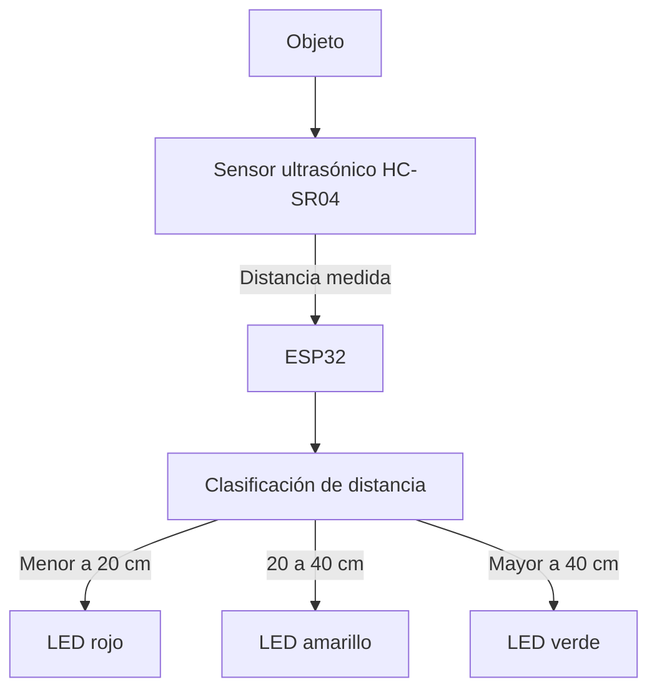
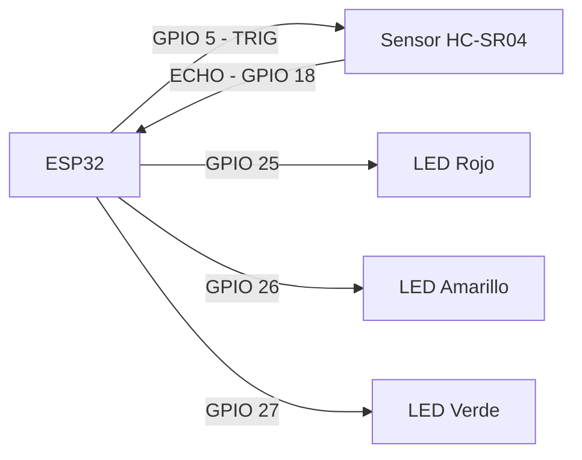
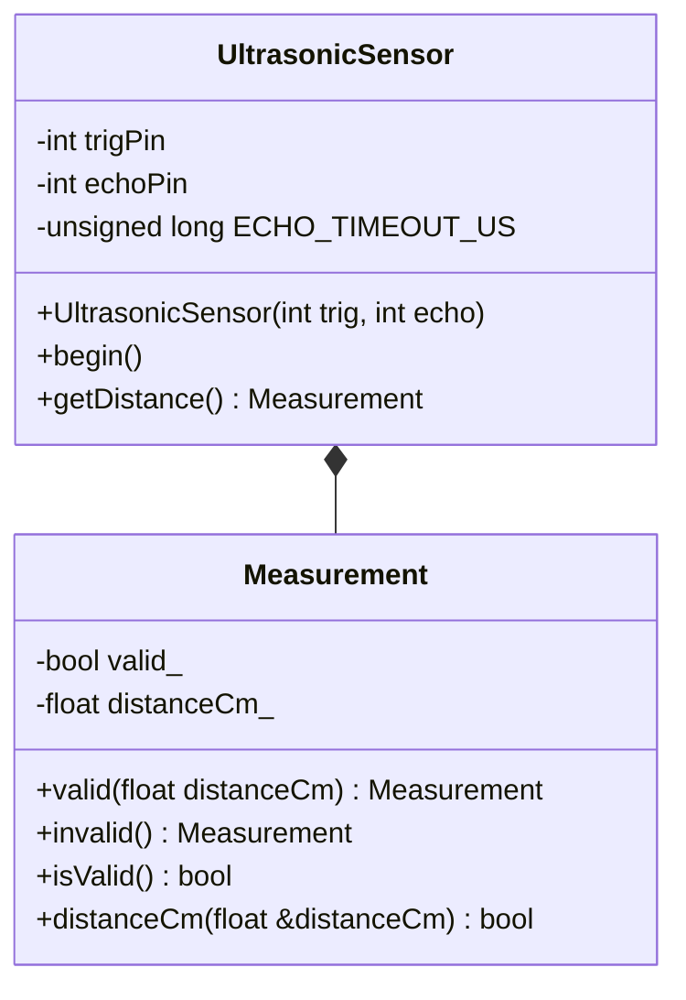
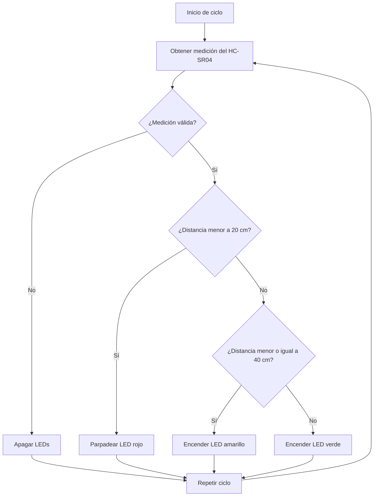

# Práctica 1 — Integración de Sensores y Actuadores en un Objeto Inteligente

## Integrantes

- Mateo Rojas Campos
- Lucia Escobar Galaburda

## Descripción del proyecto

El proyecto consiste en un objeto inteligente basado en un microcontrolador ESP32,
un sensor ultrasónico HC-SR04 y tres LEDs como actuadores.

El sistema mide la distancia entre el sensor ultrasónico y un objeto y, de acuerdo
con la distancia obtenida, activa diferentes LEDs para representar tres estados:
cercano, intermedio y lejano.

---

## 1. Requerimientos Funcionales y No Funcionales

### 1.1 Requerimientos funcionales

- **RF1 — Medición de distancia:** El sistema debe medir la distancia entre el
  sensor ultrasónico y un objeto.

- **RF2 — Clasificación de distancia:** El sistema debe clasificar la distancia
  medida en tres rangos:
  - Distancia menor a 20 cm: estado cercano.
  - Distancia entre 20 cm y 40 cm: estado intermedio.
  - Distancia mayor a 40 cm: estado lejano.

- **RF3 — Control de actuadores:** El sistema debe controlar los LEDs según la
  distancia detectada:
  - Menor a 20 cm: LED rojo parpadeando a 4 Hz.
  - Entre 20 cm y 40 cm: LED amarillo encendido.
  - Mayor a 40 cm: LED verde encendido.

### 1.2 Requerimientos no funcionales

- **RNF1 — Estabilidad:** El sistema deberá funcionar continuamente durante al
  menos 10 minutos sin reinicios ni bloqueos.

- **RNF2 — Exactitud:** La medición del sensor tendrá un error máximo permitido
  de ±3 cm respecto a una medición realizada con una referencia física.

- **RNF3 — Tiempo de respuesta:** El sistema deberá reflejar un cambio de rango
  mediante los LEDs en un tiempo máximo de 1 segundo.

- **RNF4 — Frecuencia de muestreo:** El sistema deberá realizar al menos
  2 mediciones de distancia por segundo.

- **RNF5 — Calidad del código:** El código deberá ser legible, modular,
  orientado a objetos y documentado.

---

## 2. Análisis y Diseño

### 2.1 Arquitectura del sistema

El sistema está compuesto por un sensor ultrasónico HC-SR04, un microcontrolador
ESP32 y tres LEDs utilizados como actuadores.

El sensor HC-SR04 obtiene la distancia existente entre el sensor y un objeto.
Esta información es recibida por el ESP32, que procesa y clasifica la medición
en uno de los tres rangos definidos.

Según el rango detectado, el ESP32 controla los LEDs rojo, amarillo y verde
para representar visualmente el estado de la distancia.

El flujo general del sistema es:

**Objeto → Sensor HC-SR04 → ESP32 → Clasificación de distancia → LEDs**

### 2.2 Diagrama de arquitectura



### 2.3 Conexiones del sistema

Las conexiones utilizadas entre el ESP32, el sensor ultrasónico y los LEDs son:

| Componente | Pin ESP32 |
|---|---:|
| TRIG del HC-SR04 | GPIO 5 |
| ECHO del HC-SR04 | GPIO 18 |
| LED rojo | GPIO 25 |
| LED amarillo | GPIO 26 |
| LED verde | GPIO 27 |

### 2.4 Diagrama de circuito

El siguiente diagrama representa las conexiones lógicas entre el ESP32,
el sensor ultrasónico HC-SR04 y los tres LEDs utilizados como actuadores.



### 2.5 Diagrama estructural

El software utiliza programación orientada a objetos mediante la clase
`UltrasonicSensor`, encargada de gestionar el sensor ultrasónico.

Dentro de esta clase se encuentra la clase `Measurement`, utilizada para
representar una medición y determinar si el valor obtenido es válido.



### 2.6 Diagrama de comportamiento

El funcionamiento del sistema se ejecuta de manera repetitiva. Primero se
obtiene una medición mediante el sensor ultrasónico. Si la medición no es
válida, los LEDs permanecen apagados. Si es válida, la distancia es
clasificada y se activa el actuador correspondiente.



### 2.7 Lógica de control

La lógica utilizada para controlar los actuadores se resume en la siguiente
tabla:

| Rango de distancia | Estado | Comportamiento |
|---|---|---|
| Menor a 20 cm | Cercano (`Near`) | LED rojo parpadea |
| Desde 20 cm hasta 40 cm | Intermedio (`Mid`) | LED amarillo encendido |
| Mayor a 40 cm | Lejano (`Far`) | LED verde encendido |
| Medición inválida | Inválido (`Invalid`) | Todos los LEDs apagados |

---

## 3. Desarrollo e Implementación

### 3.1 Herramientas y tecnologías utilizadas

Para el desarrollo del sistema se utilizaron las siguientes herramientas y
componentes:

- **ESP32 DOIT DevKit V1:** microcontrolador encargado del procesamiento.
- **HC-SR04:** sensor ultrasónico utilizado para medir la distancia.
- **3 LEDs:** rojo, amarillo y verde utilizados como actuadores.
- **PlatformIO:** plataforma utilizada para compilar y cargar el programa.
- **Arduino Framework:** framework utilizado para programar el ESP32.
- **C++:** lenguaje utilizado para implementar el sistema.

### 3.2 Organización del código

El código fuente se encuentra dividido en diferentes archivos con el objetivo
de separar responsabilidades y mantener una estructura modular.

```text
include/
└── UltrasonicSensor.h

src/
├── main.cpp
└── UltrasonicSensor.cpp
```

- **`UltrasonicSensor.h`:** contiene la definición de la clase
  `UltrasonicSensor` y de la clase interna `Measurement`.

- **`UltrasonicSensor.cpp`:** contiene la implementación de los métodos
  encargados de inicializar el sensor y obtener las mediciones de distancia.

- **`main.cpp`:** contiene la lógica principal del sistema: clasificación de
  las distancias, reporte mediante el monitor serial y control de los LEDs.

### 3.3 Implementación orientada a objetos

Para mantener el código modular se implementó la clase `UltrasonicSensor`,
encargada de encapsular el funcionamiento del sensor ultrasónico.

La clase almacena los pines TRIG y ECHO y proporciona los métodos principales:

- `begin()`: configura los pines necesarios para utilizar el sensor.
- `getDistance()`: realiza una medición y devuelve el resultado.
- `Measurement`: representa el resultado de una medición y permite determinar
  si esta es válida antes de utilizar su distancia.

En el programa principal se crea un objeto de esta clase:

```cpp
UltrasonicSensor sensor(TRIG_PIN, ECHO_PIN);
```

De esta manera, la lógica específica del sensor permanece separada de la
lógica principal del sistema.

### 3.4 Obtención de la distancia

Para obtener una medición, el ESP32 genera un pulso de 10 microsegundos a
través del pin TRIG del HC-SR04.

Posteriormente se mide mediante el pin ECHO la duración del pulso recibido.
La distancia se calcula utilizando:

```cpp
float distance = duration * 0.034f / 2.0f;
```

Si no se recibe un pulso dentro del tiempo máximo establecido, la medición se
considera inválida.

### 3.5 Clasificación de la distancia

Después de obtener una medición válida, la función `classifyDistance()` la
clasifica utilizando los umbrales definidos:

```cpp
constexpr float NEAR_THRESHOLD_CM = 20.0f;
constexpr float FAR_THRESHOLD_CM = 40.0f;
```

Para representar los posibles estados se utiliza:

```cpp
enum class DistanceState {
    Invalid,
    Near,
    Mid,
    Far
};
```

Los estados corresponden a:

| Estado | Condición |
|---|---|
| `Near` | Distancia < 20 cm |
| `Mid` | Distancia >= 20 cm y <= 40 cm |
| `Far` | Distancia > 40 cm |
| `Invalid` | Medición no válida |

### 3.6 Control de los LEDs

La función `applyLedState()` recibe el estado correspondiente a la distancia
medida y controla los tres LEDs.

- En estado `Near`, únicamente el LED rojo parpadea.
- En estado `Mid`, únicamente permanece encendido el LED amarillo.
- En estado `Far`, únicamente permanece encendido el LED verde.
- En estado `Invalid`, los tres LEDs permanecen apagados.

El parpadeo del LED rojo utiliza intervalos de 125 ms encendido y 125 ms
apagado.

### 3.7 Ciclo principal

El método `loop()` ejecuta continuamente la siguiente secuencia:

1. Obtener una medición mediante `sensor.getDistance()`.
2. Validar y clasificar la distancia mediante `classifyDistance()`.
3. Mostrar el resultado mediante el monitor serial con `reportMeasurement()`.
4. Aplicar el comportamiento correspondiente mediante `applyLedState()`.
5. Repetir el proceso.

De esta manera se mantiene un ciclo continuo de adquisición, procesamiento
y actuación.

---

## 4. Pruebas y Validaciones

Para comprobar el correcto funcionamiento del sistema se realizaron pruebas sobre los requerimientos funcionales y no funcionales definidos.

Las mediciones fueron comparadas utilizando una cinta métrica como referencia física y los valores obtenidos por el sensor fueron observados mediante el monitor serial de PlatformIO.

# 4. Pruebas y Validaciones

Para comprobar el correcto funcionamiento del sistema se realizaron diferentes pruebas sobre los requerimientos funcionales y no funcionales definidos.

Las mediciones de distancia fueron comparadas utilizando una cinta métrica como referencia física. Para evaluar la exactitud del sensor se realizaron **dos mediciones por cada distancia de referencia**, permitiendo obtener un promedio y reducir la influencia de pequeñas variaciones entre lecturas.

Los valores obtenidos por el sensor HC-SR04 fueron observados mediante el monitor serial de PlatformIO.

---

## 4.1 Pruebas funcionales

Se probaron diferentes distancias pertenecientes a los tres rangos definidos para verificar que el sistema activara correctamente los LEDs correspondientes.

Para cada distancia se realizaron dos mediciones con el sensor ultrasónico.

| Prueba | Distancia de referencia | Medición 1 | Medición 2 | Comportamiento esperado | Resultado observado    | Estado |
| ------ | ----------------------: | ---------: | ---------: | ----------------------- | ---------------------- | ------ |
| PF1    |                   10 cm |   10,57 cm |   10,55 cm | LED rojo parpadeando    | LED rojo parpadeando   | PASA   |
| PF2    |                   20 cm |   22,36 cm |   21,51 cm | LED amarillo encendido  | LED amarillo encendido | PASA   |
| PF3    |                   30 cm |   30,94 cm |   31,11 cm | LED amarillo encendido  | LED amarillo encendido | PASA   |
| PF4    |                   40 cm |   39,97 cm |   39,96 cm | LED amarillo encendido  | LED amarillo encendido | PASA   |
| PF5    |                   50 cm |   49,81 cm |   48,95 cm | LED verde encendido     | LED verde encendido    | PASA   |
| PF6    |                   60 cm |   58,92 cm |   59,18 cm | LED verde encendido     | LED verde encendido    | PASA   |

Los resultados muestran que el sistema clasifica correctamente las mediciones obtenidas dentro de los diferentes rangos establecidos.

También se realizó una prueba específica alrededor del límite de **40 cm**. Mientras la distancia medida permaneció en valores menores o iguales a 40 cm, el LED amarillo continuó encendido. Al aumentar la distancia aproximadamente hasta **40,1 cm**, el sistema cambió al estado lejano y encendió correctamente el LED verde.

Este comportamiento coincide con la lógica implementada:

* Distancia menor a 20 cm: estado `Near`.
* Distancia entre 20 cm y 40 cm: estado `Mid`.
* Distancia mayor a 40 cm: estado `Far`.

Por lo tanto, los requerimientos funcionales relacionados con la medición, clasificación de distancia y control de los actuadores fueron cumplidos correctamente.

**Resultado: PASA.**

---

## 4.2 Prueba de exactitud

Para evaluar la exactitud del sensor ultrasónico HC-SR04, se compararon las mediciones obtenidas por el sistema con distancias establecidas utilizando una cinta métrica.

Para cada distancia de referencia se realizaron **dos mediciones independientes**.

Posteriormente, se calculó el promedio mediante:

**Promedio = (Medición 1 + Medición 2) / 2**

El error absoluto se calculó mediante:

**Error absoluto = |Promedio de las mediciones - Distancia de referencia|**

Los resultados obtenidos fueron los siguientes:

| Distancia de referencia | Medición 1 | Medición 2 | Promedio | Error absoluto | ¿Cumple ±3 cm? |
| ----------------------: | ---------: | ---------: | -------: | -------------: | -------------- |
|                   10 cm |   10,57 cm |   10,55 cm | 10,56 cm |        0,56 cm | Sí             |
|                   20 cm |   22,36 cm |   21,51 cm | 21,94 cm |        1,94 cm | Sí             |
|                   30 cm |   30,94 cm |   31,11 cm | 31,03 cm |        1,03 cm | Sí             |
|                   40 cm |   39,97 cm |   39,96 cm | 39,97 cm |        0,03 cm | Sí             |
|                   50 cm |   49,81 cm |   48,95 cm | 49,38 cm |        0,62 cm | Sí             |
|                   60 cm |   58,92 cm |   59,18 cm | 59,05 cm |        0,95 cm | Sí             |

Los errores absolutos obtenidos fueron:

* 10 cm: |10,56 - 10| = **0,56 cm**
* 20 cm: |21,94 - 20| = **1,94 cm**
* 30 cm: |31,03 - 30| = **1,03 cm**
* 40 cm: |39,97 - 40| = **0,03 cm**
* 50 cm: |49,38 - 50| = **0,62 cm**
* 60 cm: |59,05 - 60| = **0,95 cm**

El **error máximo obtenido fue de 1,94 cm**, correspondiente a la distancia de referencia de 20 cm.

Debido a que todos los errores obtenidos se encuentran por debajo del margen máximo permitido de **±3 cm**, se considera que el sistema cumple con el requerimiento RNF2 de exactitud.

**Resultado: PASA.**

---

## 4.3 Prueba de estabilidad

Para evaluar la estabilidad del sistema se mantuvo el prototipo funcionando continuamente durante un periodo mínimo de **10 minutos**, de acuerdo con el requerimiento RNF1.

Durante los primeros **10 minutos de funcionamiento**, el sistema realizó las mediciones y controló los LEDs con normalidad. No se observaron reinicios, bloqueos ni comportamientos inesperados durante el periodo establecido por el requerimiento.

Los resultados durante los primeros 10 minutos fueron:

* Tiempo de funcionamiento requerido: **10 minutos**
* Reinicios observados: **0**
* Bloqueos observados: **0**
* Comportamientos inesperados durante los 10 minutos: **0**
* Resultado respecto al RNF1: **PASA**

Sin embargo, se decidió continuar la observación después de completar los 10 minutos establecidos.

Alrededor del **minuto 11**, el monitor serial utilizado para visualizar las mediciones dejó de mostrar correctamente los valores obtenidos. Después de presentarse este comportamiento, el sistema comenzó a generar **mediciones inválidas**.

Esta anomalía ocurrió después de haber superado el periodo mínimo de 10 minutos establecido por el requerimiento RNF1, por lo que el sistema cumple formalmente con dicho requerimiento. No obstante, el comportamiento observado después del minuto 11 queda registrado como una incidencia que debe ser considerada para futuras pruebas y revisiones del sistema.

No se determinó durante esta prueba si el origen del problema correspondía al monitor serial, la comunicación con el ESP32, el sensor ultrasónico o algún otro elemento del sistema.

**Resultado: PASA, con observación posterior al tiempo requerido.**

---

## 4.4 Prueba de tiempo de respuesta

Para evaluar el tiempo de respuesta del sistema se cambió la posición del objeto entre los diferentes rangos de distancia y se observó el tiempo requerido para que el LED correspondiente reflejara el nuevo estado.

Durante las pruebas se observó que los cambios de estado se producían aproximadamente entre **0,5 y 0,8 segundos**.

Los resultados obtenidos fueron:

| Cambio realizado | Tiempo de respuesta observado | ¿Cumple ≤ 1 s? |
| ---------------- | ----------------------------: | -------------- |
| Rojo → Amarillo  |             Entre 0,5 y 0,8 s | Sí             |
| Amarillo → Verde |             Entre 0,5 y 0,8 s | Sí             |
| Verde → Amarillo |             Entre 0,5 y 0,8 s | Sí             |
| Amarillo → Rojo  |             Entre 0,5 y 0,8 s | Sí             |

El tiempo máximo observado fue de aproximadamente **0,8 segundos**.

Debido a que todos los cambios de estado se produjeron en un tiempo inferior al máximo establecido de **1 segundo**, el sistema cumple con el requerimiento RNF3 de tiempo de respuesta.

**Resultado: PASA.**

---

## 4.5 Prueba de funcionamiento y frecuencia de los actuadores

Para comprobar el comportamiento de los actuadores, se dejó funcionando el programa continuamente durante un periodo de **2 minutos**.

Durante este periodo se observaron las lecturas realizadas por el sensor ultrasónico y el comportamiento de cada uno de los LEDs dependiendo del rango de distancia detectado.

En el estado cercano, correspondiente a distancias menores a 20 cm, el LED rojo presenta un parpadeo con una frecuencia de **4 Hz**.

El parpadeo se encuentra configurado utilizando:

* **125 ms encendido**
* **125 ms apagado**

Por lo tanto, un ciclo completo tiene una duración de:

**125 ms + 125 ms = 250 ms**

La frecuencia del parpadeo se obtiene mediante:

**Frecuencia = 1 / 0,25 s = 4 Hz**

Esto significa que el LED rojo realiza aproximadamente **4 ciclos completos de encendido y apagado por segundo**.

En los otros dos estados, los LEDs permanecen encendidos de manera constante:

| Estado     | Rango            | LED      | Comportamiento      |
| ---------- | ---------------- | -------- | ------------------- |
| Cercano    | Menor a 20 cm    | Rojo     | Parpadeo a 4 Hz     |
| Intermedio | Entre 20 y 40 cm | Amarillo | Encendido constante |
| Lejano     | Mayor a 40 cm    | Verde    | Encendido constante |

Durante los dos minutos de observación, los actuadores mantuvieron correctamente su comportamiento dependiendo de la distancia detectada.

**Resultado: PASA.**

---

## 4.6 Validación de calidad del código

Para el desarrollo del sistema se utilizó programación orientada a objetos mediante la clase `UltrasonicSensor`, encargada de encapsular el funcionamiento específico del sensor ultrasónico.

El programa también separa las diferentes responsabilidades mediante funciones encargadas de:

* Obtener las mediciones del sensor.
* Validar las mediciones obtenidas.
* Clasificar las distancias.
* Reportar la información mediante el monitor serial.
* Controlar el comportamiento de los LEDs.

El código se encuentra organizado en diferentes archivos:

```text
include/
└── UltrasonicSensor.h

src/
├── main.cpp
└── UltrasonicSensor.cpp
```

Esta organización permite separar la definición e implementación del sensor de la lógica principal del sistema, facilitando la lectura, mantenimiento y modificación del código.

Además, el uso de constantes para los umbrales de distancia y los pines permite modificar fácilmente los parámetros del sistema sin alterar directamente la lógica de funcionamiento.

Por estas razones, se considera que el sistema cumple con el requerimiento RNF5 relacionado con la calidad, modularidad y organización del código.

**Resultado: PASA.**

---

## 4.7 Evidencias

Como evidencia de las pruebas realizadas se adjuntaron diferentes registros del funcionamiento del sistema.

Las evidencias incluyen:

* Fotografías del prototipo completo.
* Fotografías del ESP32, sensor HC-SR04 y LEDs conectados.
* Fotografías de la cinta métrica utilizada como referencia física.
* Fotografías del LED rojo funcionando en el estado cercano.
* Fotografías del LED amarillo funcionando en el estado intermedio.
* Fotografías del LED verde funcionando en el estado lejano.
* Capturas del monitor serial mostrando las mediciones obtenidas.
* Evidencias de las mediciones realizadas a 10 cm, 20 cm, 30 cm, 40 cm, 50 cm y 60 cm.
* Evidencia del comportamiento del sistema alrededor del límite de 40 cm.
* Evidencia del funcionamiento normal durante los primeros 10 minutos.
* Evidencia, en caso de estar disponible, del problema presentado aproximadamente después del minuto 11 y de las mediciones inválidas posteriores.

Estas evidencias permiten respaldar los resultados registrados durante la validación del prototipo.

---

# 5. Resultados

Las pruebas realizadas permitieron comprobar el funcionamiento del sistema desarrollado mediante el ESP32, el sensor ultrasónico HC-SR04 y los tres LEDs utilizados como actuadores.

Para evaluar la exactitud del sensor se realizaron **dos mediciones por cada distancia de referencia**, obteniendo posteriormente el promedio de ambas lecturas.

Los resultados fueron:

| Distancia de referencia | Promedio obtenido | Error absoluto |
| ----------------------: | ----------------: | -------------: |
|                   10 cm |          10,56 cm |        0,56 cm |
|                   20 cm |          21,94 cm |        1,94 cm |
|                   30 cm |          31,03 cm |        1,03 cm |
|                   40 cm |          39,97 cm |        0,03 cm |
|                   50 cm |          49,38 cm |        0,62 cm |
|                   60 cm |          59,05 cm |        0,95 cm |

El mayor error absoluto registrado fue de **1,94 cm**, correspondiente a la distancia de referencia de **20 cm**.

Este valor se encuentra dentro del margen máximo permitido de **±3 cm**, por lo que el sistema cumple con el requerimiento de exactitud establecido.

También se comprobó el correcto funcionamiento de los tres estados del sistema:

* Para distancias menores a 20 cm, el sistema activa el estado cercano y el LED rojo parpadea a una frecuencia de **4 Hz**.
* Para distancias entre 20 cm y 40 cm, se activa el estado intermedio y el LED amarillo permanece encendido de manera constante.
* Para distancias mayores a 40 cm, se activa el estado lejano y el LED verde permanece encendido de manera constante.

Durante las pruebas realizadas alrededor del límite superior del estado intermedio se obtuvieron mediciones de **39,97 cm y 39,96 cm** para una distancia de referencia de 40 cm. En ambos casos, el LED amarillo permaneció encendido correctamente.

Al aumentar la distancia hasta aproximadamente **40,1 cm**, se observó el cambio del LED amarillo al LED verde, demostrando que el sistema identifica correctamente el límite entre los estados `Mid` y `Far`.

El tiempo de respuesta del sistema también fue evaluado realizando cambios entre los diferentes rangos de distancia. Los cambios de estado se produjeron aproximadamente entre **0,5 y 0,8 segundos**.

Debido a que el tiempo máximo observado fue de aproximadamente **0,8 segundos**, el sistema cumple con el requisito establecido de responder en un tiempo máximo de 1 segundo.

Durante una prueba continua de **2 minutos**, se verificó el comportamiento de los actuadores. El LED rojo mantuvo una frecuencia de parpadeo de **4 Hz**, mientras que los LEDs amarillo y verde permanecieron encendidos de manera constante cuando el sistema se encontraba dentro de sus respectivos rangos.

En la prueba de estabilidad, el sistema funcionó con normalidad durante los **10 minutos requeridos**, sin reinicios, bloqueos ni comportamientos inesperados. Por esta razón se considera cumplido el requerimiento RNF1.

Sin embargo, al extender la prueba más allá del tiempo requerido, aproximadamente en el **minuto 11**, el monitor serial dejó de visualizar correctamente las mediciones. Posteriormente, comenzaron a generarse mediciones inválidas.

Aunque este problema ocurrió después del periodo establecido por el requerimiento de estabilidad, constituye una observación importante para futuras pruebas, debido a que indica que el funcionamiento durante periodos superiores a 10 minutos debe ser investigado con mayor profundidad.

En general, los resultados obtenidos muestran que el sistema cumple con las pruebas funcionales, de exactitud y de tiempo de respuesta planteadas, además de funcionar correctamente durante el periodo mínimo de estabilidad establecido.

---

# 6. Conclusiones

La práctica permitió integrar correctamente un sensor ultrasónico HC-SR04 y tres actuadores LED mediante el uso de un microcontrolador ESP32.

El sensor ultrasónico permitió obtener mediciones de distancia que posteriormente fueron procesadas por el ESP32 para determinar el estado correspondiente y activar el LED adecuado.

Las pruebas de exactitud demostraron que las mediciones realizadas se encuentran dentro del margen máximo permitido de **±3 cm**. El mayor error registrado fue de **1,94 cm**, correspondiente a la distancia de referencia de 20 cm.

La realización de dos mediciones para cada distancia permitió comparar los valores obtenidos y calcular un promedio más representativo del funcionamiento del sensor.

También se comprobó correctamente el comportamiento del sistema alrededor del límite de **40 cm**. Con mediciones de **39,97 cm y 39,96 cm**, el sistema mantuvo el LED amarillo encendido, mientras que al superar aproximadamente los 40 cm se produjo correctamente el cambio al LED verde.

El tiempo de respuesta observado se mantuvo aproximadamente entre **0,5 y 0,8 segundos**, encontrándose dentro del máximo permitido de 1 segundo.

El LED rojo presentó correctamente una frecuencia de parpadeo de **4 Hz**, mientras que los LEDs amarillo y verde permanecieron encendidos de manera constante en sus respectivos estados.

En cuanto a la estabilidad, el sistema logró funcionar correctamente durante los **10 minutos establecidos como requisito**, sin presentar reinicios ni bloqueos. Sin embargo, al extender la prueba aproximadamente hasta el minuto 11, el monitor serial dejó de mostrar las mediciones y posteriormente comenzaron a aparecer mediciones inválidas.

Este comportamiento no impide el cumplimiento del requerimiento de estabilidad establecido para la práctica, pero representa una limitación observada que deberá analizarse en futuras pruebas para determinar su causa y mejorar el funcionamiento del sistema durante periodos prolongados.

Finalmente, la utilización de programación orientada a objetos y la separación del código en diferentes archivos permitió mantener una implementación modular, organizada y de fácil mantenimiento.

En conclusión, el prototipo desarrollado cumple con los principales requerimientos funcionales y no funcionales evaluados durante la práctica, aunque se identificó una anomalía durante el funcionamiento prolongado que deberá ser investigada posteriormente.

# 7. Recomendaciones

A partir de las pruebas realizadas y de los resultados obtenidos, se plantean las siguientes recomendaciones para mejorar el funcionamiento y la confiabilidad del sistema:

* Realizar pruebas de funcionamiento durante periodos superiores a 10 minutos para identificar con mayor precisión la causa de las mediciones inválidas observadas aproximadamente después del minuto 11.

* Verificar la estabilidad de la comunicación serial entre el ESP32 y el computador, debido a que durante la prueba prolongada el monitor serial dejó de mostrar correctamente las mediciones.

* Revisar las conexiones del sensor ultrasónico HC-SR04, especialmente las líneas de alimentación, TRIG y ECHO, para descartar conexiones inestables que puedan generar mediciones inválidas.

* Realizar varias mediciones consecutivas para cada distancia y utilizar promedios cuando se requiera mayor precisión, ya que el sensor puede presentar pequeñas variaciones entre lecturas.

* Evitar colocar el objeto en posiciones inclinadas o utilizar superficies irregulares durante las pruebas, debido a que esto puede afectar el rebote de la señal ultrasónica y producir mediciones incorrectas.

* Mantener el sensor ultrasónico correctamente alineado con el objeto utilizado como referencia para obtener mediciones más confiables.

* Realizar pruebas adicionales alrededor de los valores límite de 20 cm y 40 cm para verificar con mayor detalle el comportamiento del sistema durante los cambios de estado.

* Implementar en futuras versiones un filtrado de mediciones, por ejemplo mediante un promedio de varias lecturas, para reducir variaciones y evitar cambios innecesarios de estado cuando la distancia se encuentra cerca de los límites.

* Incluir mecanismos adicionales para detectar y recuperar automáticamente el sistema cuando se produzcan varias mediciones inválidas consecutivas.

* Continuar manteniendo la estructura modular y orientada a objetos del código, ya que facilita la identificación de errores, mantenimiento y futuras ampliaciones del proyecto.

En general, el prototipo presenta un funcionamiento adecuado para los requerimientos planteados, pero las pruebas prolongadas permitirán mejorar su estabilidad y confiabilidad.
